# 欧加网络助手（Oplus Network Helper）

[English version](README.en.md)

面向 Android 高通/联发科设备的网络与信号分析工具。应用包名为
`com.nvmex.networkhelper`，使用 Jetpack Compose 构建，并包含独立的 VPN/热点功能模块。

## 最新版本

- [v1.4.5 ARM64 安装包](https://github.com/mazemingw/oplus-network-helper/releases/tag/v1.4.5)
- 架构：`arm64-v8a`
- SHA-256：`624EEC9EA2FE25152A4320CD6C44758B8DA820A38DFDF0CAFDFF58E3609DED04`

## 主要功能

- **双卡网络面板**：对比 SIM1/SIM2 的运营商、数据网/NR 模式、频段、频点、小区和链路信息。
- **信号质量**：显示 RSRP、RSRQ、SINR、RSSI、信号等级和评分，并支持历史信号曲线。
- **路测地图**：记录定位轨迹和网络打点，支持双卡数据查看与切换。
- **高通 QOS**：查看全局事件、Paging/Mobility、NAS 状态等调试数据。
- **工程模式工具**：访问网络工程模式能力，并提供工程模式文件清理工具。
- **频段与小区**：查看和分析 LTE/NR 频段、小区参数、载波聚合等信息。
- **网络工具**：集成 iPerf 测速、Wi-Fi 信息、Ping 和 VPN/热点管理。
- **Xposed/厂商接口**：部分高级功能需要 root、Xposed/LSPosed 或特定厂商系统接口。

## 截图

截图按功能模块存放在 [`docs/images`](docs/images) 中，点击图片可查看原图。

### HOME：首页

<p>
  <a href="docs/images/home/home.png">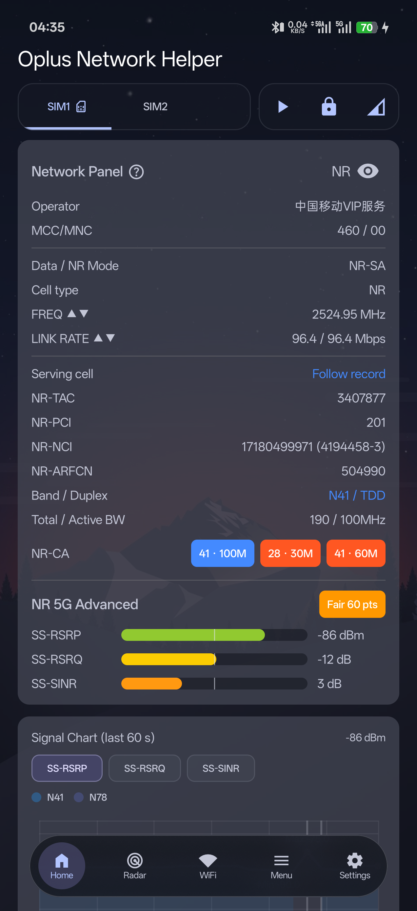</a>
  <a href="docs/images/home/control-panel.png">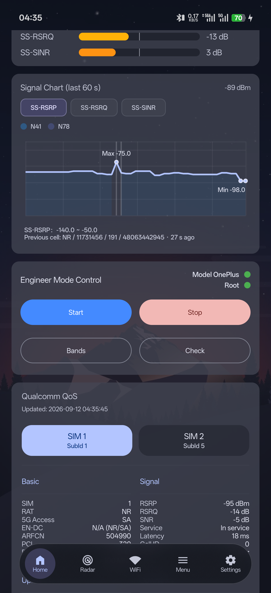</a>
  <a href="docs/images/home/qos-data.png">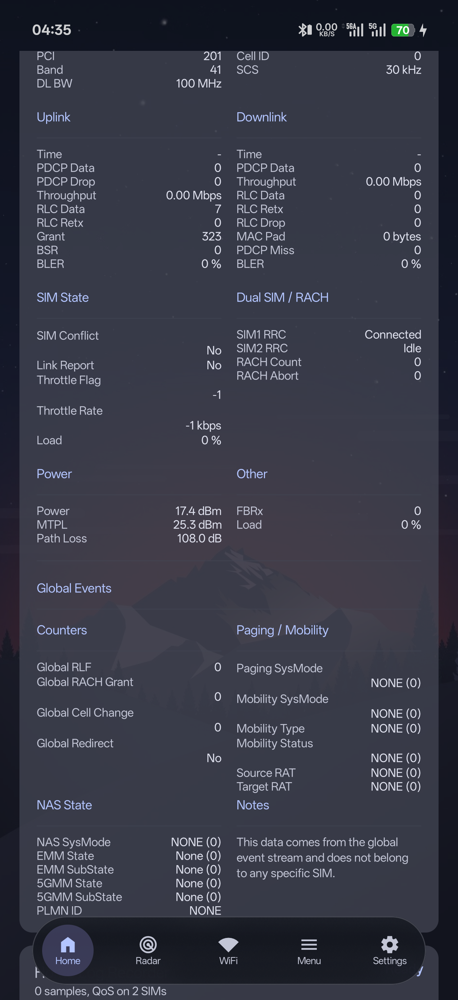</a>
</p>

### LOCKBAND：锁频

<p>
  <a href="docs/images/LOCKBAND/Screenshot_2026-09-12-04-56-43-38_0b59cd5314832a..png">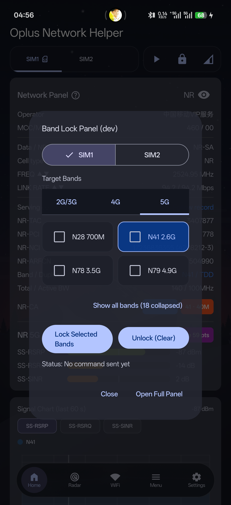</a>
  <a href="docs/images/LOCKBAND/Screenshot_2026-09-12-04-56-54-70_0b59cd5314832a..png">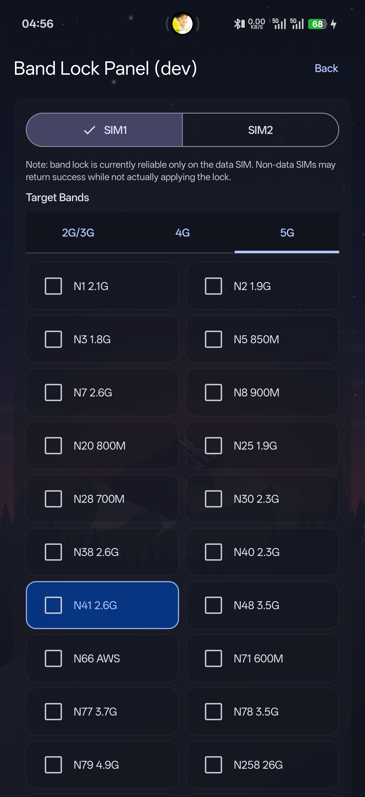</a>
</p>

### RADAR：雷达

<p>
  <a href="docs/images/radar/Screenshot_2026-09-12-04-37-58-73_0b59cd5314832a..png">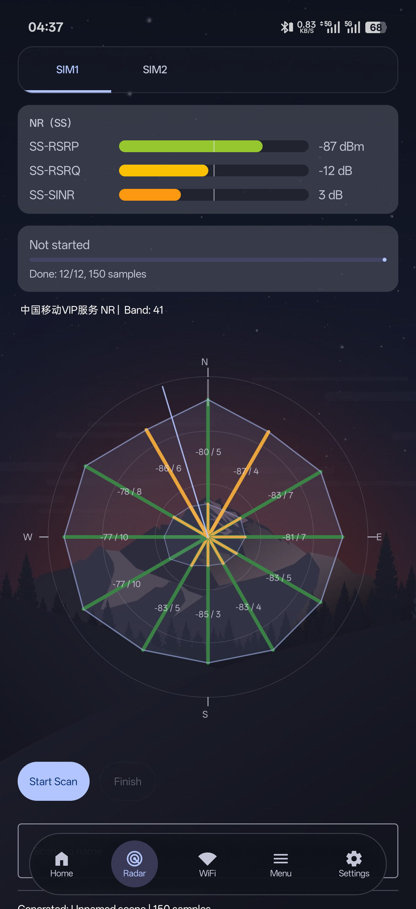</a>
</p>

### WIFI：Wi-Fi

<p>
  <a href="docs/images/WIFI/Screenshot_2026-09-12-04-38-19-73_0b59cd5314832a..png">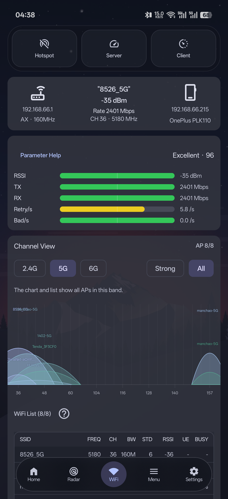</a>
  <a href="docs/images/WIFI/Screenshot_2026-09-12-04-38-32-71_0b59cd5314832a..png">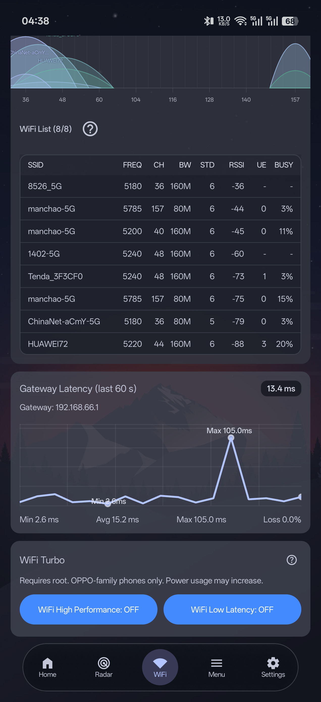</a>
</p>

### HOTSPOT：热点

<p>
  <a href="docs/images/hotspot/Screenshot_2026-09-12-04-38-57-83_0b59cd5314832a..png">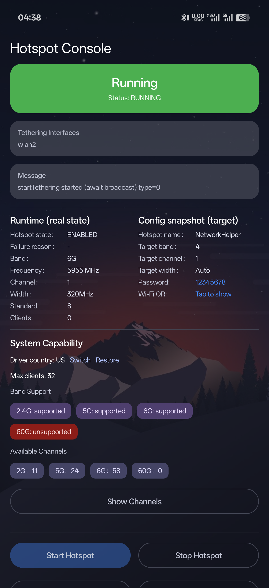</a>
</p>

### MENU：菜单

<p>
  <a href="docs/images/menu/Screenshot_2026-09-12-04-39-08-14_0b59cd5314832a..png">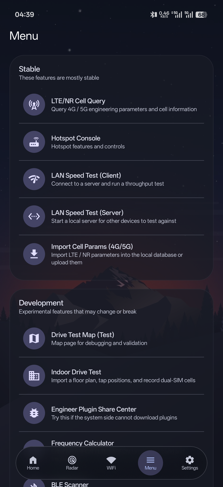</a>
  <a href="docs/images/menu/Screenshot_2026-09-12-04-39-11-61_0b59cd5314832a..png">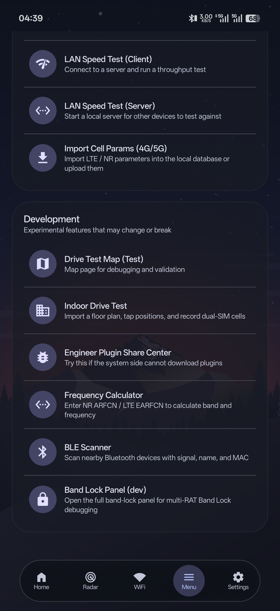</a>
</p>

### SETTINGS：设置

<p>
  <a href="docs/images/settings/Screenshot_2026-09-12-04-39-27-05_0b59cd5314832a..png">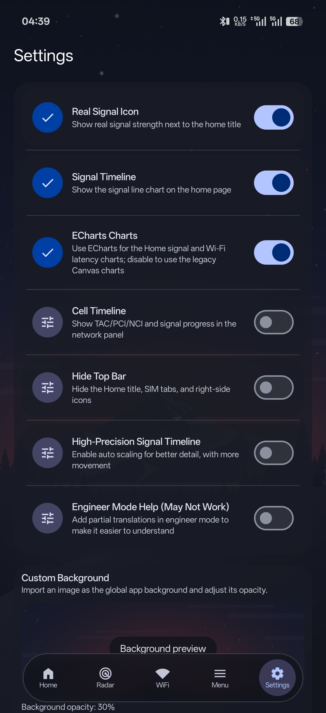</a>
  <a href="docs/images/settings/Screenshot_2026-09-12-04-39-31-15_0b59cd5314832a..png">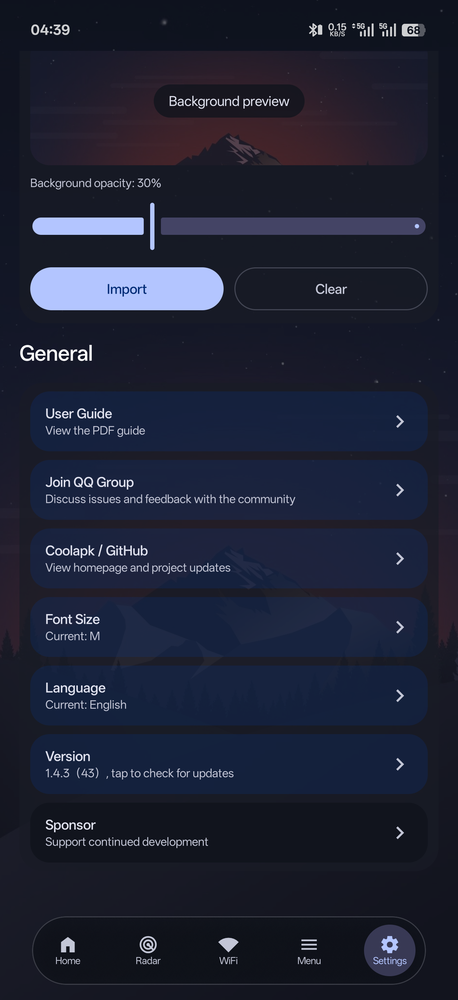</a>
</p>

## 构建环境

- Android Studio（建议使用稳定版）
- JDK 17（Gradle 8.13 不支持 JDK 25）
- Android SDK 36
- Android NDK `26.3.11579264`
- CMake `3.22.1`

在 Android Studio 中打开项目根目录并等待 Gradle 同步：

```bash
./gradlew assembleDebug
```

Windows PowerShell：

```powershell
.\gradlew.bat assembleDebug
```

## 配置说明

本地配置、签名文件、私钥和 Firebase 配置不会提交到仓库。
高德地图 Key 通过 Gradle 参数注入：

```powershell
.\gradlew.bat assembleDebug -PAMAP_API_KEY=你的高德Key
```

也可以将 `AMAP_API_KEY=你的高德Key` 写入用户级 Gradle 配置。部分功能需要 root、厂商接口或实体设备，在普通模拟器上可能不可用。

## 项目结构

```text
app/                  主应用模块
vpnhotspot-mobile/    VPN/热点库模块
gradle/               Gradle wrapper 与依赖版本
```

## 许可证

本项目原创代码采用 **Apache License 2.0**，详见 [LICENSE](LICENSE)。仓库还包含采用其他许可证的第三方代码；请阅读 [THIRD_PARTY_NOTICES.md](THIRD_PARTY_NOTICES.md)，并保留相应的版权和许可证声明。
